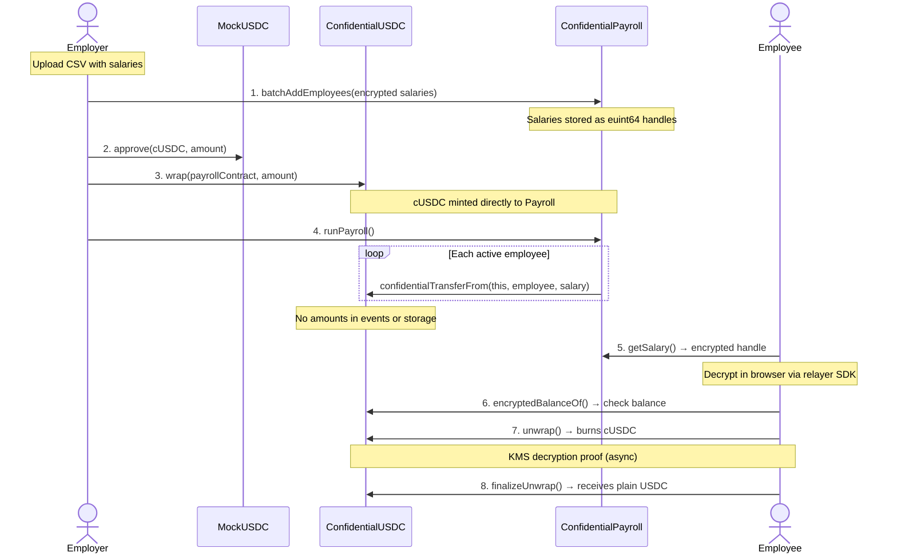
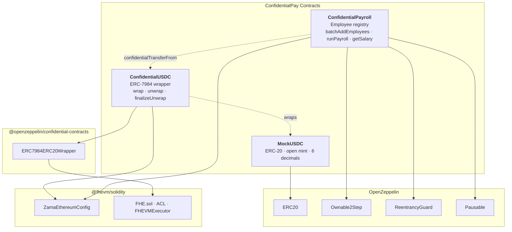
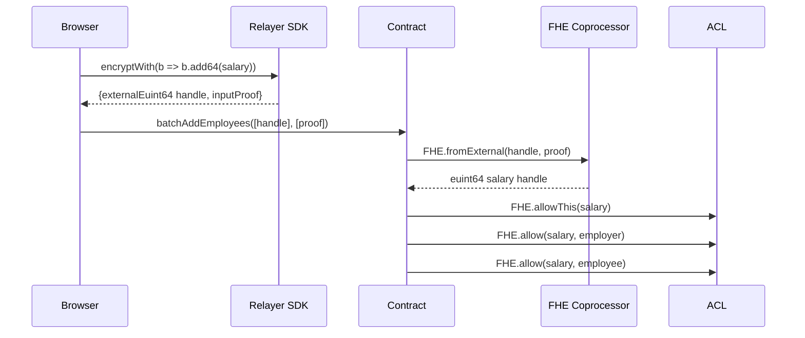
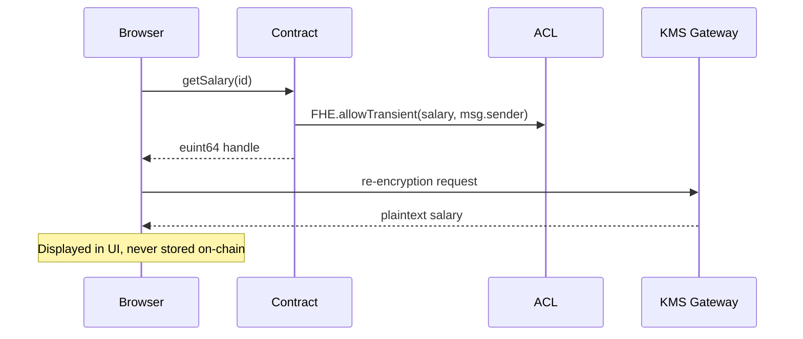
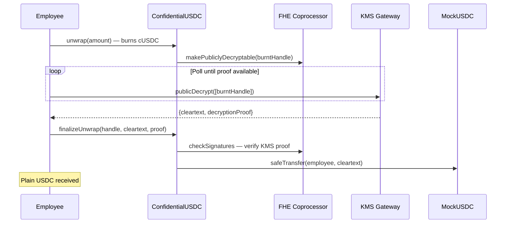

# ConfidentialPay

On-chain payroll where employers pay employees in **encrypted USDC**. Salary amounts, balances, and transfer values stay private on-chain using the [fhEVM coprocessor](https://docs.zama.ai/protocol) and [ERC-7984](https://ethereum-magicians.org/t/erc-7984-confidential-token-standard/22517) confidential tokens.

An external observer sees only transaction hashes and opaque ciphertext handles. No salary data is ever exposed.

**Live on Sepolia** — fully client-side, no backend.

---

## 🎥 Demo

- **Live App:** https://cops-monorepo-nextjs.vercel.app/
- **Video Demo:** https://vimeo.com/1173634365?share=copy&fl=sv&fe=ci

## User Flows

### Employer
1. Connect employer wallet
2. Import employees via CSV or add them manually
3. Register employees — salaries are encrypted onchain at submission
4. Reveal any employee salary (employer has full access via ACL)
5. Fund payroll: Mint USDC → Approve → Shield into cUSDC
6. Run payroll in one transaction — amounts stay encrypted end to end

### Employee
1. Connect employee wallet and navigate to the Employee Portal
2. View own encrypted salary and click Reveal to decrypt it
3. View own encrypted cUSDC balance and Reveal it
4. Unshield cUSDC back to plain USDC — KMS generates decryption proof, funds are received

---

## Deployed Contracts

| Contract | Address | Description |
|---|---|---|
| MockUSDC | [`0x6F140c...552EA`](https://sepolia.etherscan.io/address/0x6F140cD89f6Ed33A252cD5E55204106C14C552EA#code) | ERC-20 testnet USDC (open mint, 6 decimals) |
| ConfidentialUSDC | [`0x7B0071...894A`](https://sepolia.etherscan.io/address/0x7B0071049961d62cB6C769D8Fa29990b2aA4894A#code) | ERC-7984 wrapper (USDC ↔ cUSDC) |
| ConfidentialPayroll | [`0xfE745b...311f`](https://sepolia.etherscan.io/address/0xfE745b22a6586DA07561f24D0b4D8A3441C1311f#code) | Employee registry + payroll execution |

Network: **Sepolia** (chainId `11155111`)

---

## How It Works



All FHE operations happen transparently via the Zama relayer SDK. Users only need a Sepolia wallet.

---

## Stack

| Layer | Technology |
|---|---|
| **Contracts** | Solidity 0.8.27, [`@fhevm/solidity ^0.11.1`](https://docs.zama.ai/protocol/solidity-guides), [`@openzeppelin/confidential-contracts 0.3.1`](https://www.npmjs.com/package/@openzeppelin/confidential-contracts), Hardhat |
| **Frontend** | Next.js 15, React 19, TypeScript 5.8, Wagmi 2, Viem 2, RainbowKit |
| **FHE** | [`@zama-fhe/relayer-sdk 0.4.1`](https://www.npmjs.com/package/@zama-fhe/relayer-sdk), `@fhevm-sdk` (workspace hooks) |
| **Styling** | TailwindCSS 4, DaisyUI 5 |
| **State** | Zustand |
| **Deploy** | Vercel (static), Sepolia testnet |

---

## Project Structure

```
cops-monorepo/
├── packages/
│   ├── hardhat/                     Smart contracts + tests + deploy
│   │   ├── contracts/
│   │   │   ├── MockUSDC.sol                 ERC-20 testnet USDC (open mint)
│   │   │   ├── ConfidentialUSDC.sol         ERC-7984 wrapper (wrap/unwrap)
│   │   │   ├── ConfidentialPayroll.sol      Employee registry + payroll
│   │   │   └── interfaces/
│   │   │       └── IConfidentialUSDC.sol    Minimal interface
│   │   ├── deploy/                          Hardhat-deploy scripts
│   │   ├── test/                            Unit + E2E tests (mock coprocessor)
│   │   └── scripts/                         ABI generation, ownership transfer
│   │
│   ├── nextjs/                      Frontend (Next.js 15 App Router)
│   │   ├── app/
│   │   │   ├── employer/page.tsx            CSV upload, fund, run payroll
│   │   │   └── employee/page.tsx            Decrypt salary, balance, unwrap
│   │   ├── hooks/cops/                      All payroll hooks
│   │   ├── components/ui/                   Shared UI components
│   │   └── utils/cops/                      CSV parser, formatters, addresses
│   │
│   └── fhevm-sdk/                   FHE hook library (workspace package)
│       └── src/
│           ├── useFHEEncryption.ts           Encrypt values for contract calls
│           ├── useFHEDecrypt.ts              Decrypt handles from contracts
│           └── useInMemoryStorage.ts         Session storage for decrypt sigs
│
├── docs/
│   ├── PRD.md                       Full technical spec (v1.0.0)
│   └── architecture.md              Mermaid diagrams (contracts, FHE, flows)
│
└── package.json                     pnpm workspace root
```

---

## Prerequisites

- **Node.js** >= 20
- **pnpm** >= 10
- **Alchemy API key** (Sepolia RPC) — [get one free](https://dashboard.alchemyapi.io)

---

## Quick Start

### 1. Install dependencies

```bash
git clone https://github.com/BootNodeDev/cops-monorepo.git
cd cops-monorepo
pnpm install
```

### 2. Configure Hardhat variables

Required for deploying contracts or running Sepolia tests:

```bash
cd packages/hardhat
npx hardhat vars set DEPLOYER_PK "0x<your_private_key>"
npx hardhat vars set ALCHEMY_API_KEY "<your_alchemy_key>"
npx hardhat vars set ETHERSCAN_API_KEY "<your_etherscan_key>"
```

### 3. Run contract tests (local, no Docker)

```bash
cd packages/hardhat
pnpm test           # 55 tests, mock FHE coprocessor
pnpm coverage       # ~98% line coverage
```

### 4. Start the frontend

```bash
# From repo root
cp packages/nextjs/.env.example packages/nextjs/.env.local
```

Edit `packages/nextjs/.env.local`:

```env
NEXT_PUBLIC_ALCHEMY_API_KEY=<your_alchemy_key>
```

Then:

```bash
pnpm start
# Open http://localhost:3000
```

---

## Deploy Contracts to Sepolia

```bash
cd packages/hardhat

# Deploy all three contracts
pnpm deploy:sepolia

# Generate frontend ABI + address data
npx ts-node scripts/generateDeployedContracts.ts sepolia
```

After deploying, the contract addresses are written to `packages/nextjs/contracts/deployedContracts.ts`. The frontend picks them up automatically.

### Transfer ownership (if needed)

The deployer wallet owns `ConfidentialPayroll`. To transfer to another address:

```bash
cd packages/hardhat
npx hardhat transfer-ownership \
  --to <new_owner_address> \
  --network sepolia
```

This uses `Ownable2Step` — the new owner must call `acceptOwnership()` to complete the transfer.

---

## Deploy Frontend to Vercel

### Vercel project settings

| Setting | Value |
|---|---|
| **Root Directory** | `packages/nextjs` |
| **Framework** | Next.js |
| **Install Command** | `pnpm install` |
| **Build Command** | `pnpm run build` |
| **Node.js Version** | 20.x |

### Environment variables

| Variable | Required | Description |
|---|---|---|
| `NEXT_PUBLIC_ALCHEMY_API_KEY` | Yes | Sepolia RPC provider |
| `NEXT_PUBLIC_IGNORE_BUILD_ERROR` | Yes (for now) | Set to `true` — pre-existing type errors in example files |
| `NEXT_PUBLIC_WALLET_CONNECT_PROJECT_ID` | No | WalletConnect project ID (has fallback) |
| `NEXT_PUBLIC_MOCK_USDC_ADDRESS` | No | Override deployed MockUSDC address |
| `NEXT_PUBLIC_CUSDC_ADDRESS` | No | Override deployed ConfidentialUSDC address |
| `NEXT_PUBLIC_PAYROLL_ADDRESS` | No | Override deployed ConfidentialPayroll address |

---

## Contract Architecture



### MockUSDC

Standard ERC-20 with open `mint()` and 6 decimals. Testnet only.

### ConfidentialUSDC

ERC-7984 wrapper built on `@openzeppelin/confidential-contracts`. Converts plain USDC to encrypted cUSDC via `wrap()` and back via the async two-step `unwrap()` → `finalizeUnwrap()` flow.

### ConfidentialPayroll

Employee registry with FHE-encrypted salaries. The employer uploads employees via CSV, salaries are encrypted client-side and stored as `euint64` handles on-chain. `runPayroll()` transfers each employee's salary in a single transaction — all amounts stay encrypted.

Key design decisions:
- **No `depositFunds()`** — employer calls `cUSDC.wrap(payrollContract, amount)` directly. ERC-7984's self-operator pattern lets the contract spend its own balance.
- **Salary immutability** — salaries can't be changed after registration. To update: deactivate + re-add.
- **Saturating arithmetic** — if the contract has insufficient balance, `runPayroll` transfers 0 instead of reverting, ensuring one underfunded payment doesn't block all others.

For detailed diagrams covering the FHE coprocessor, encryption lifecycle, and trust boundaries, see [`docs/architecture.md`](docs/architecture.md).

---

## FHE Encryption Flow

### Encrypt (client → contract)



### Decrypt (contract → client)



### Unwrap (cUSDC → USDC)



---

## Available Scripts

Run from the repo root unless noted otherwise.

| Script | Description |
|---|---|
| `pnpm start` | Start frontend dev server |
| `pnpm test` | Run contract tests (mock FHE) |
| `pnpm compile` | Compile Solidity contracts |
| `pnpm deploy:sepolia` | Deploy contracts to Sepolia |
| `pnpm next:build` | Build frontend for production |
| `pnpm next:check-types` | TypeScript type-check (frontend) |
| `pnpm next:lint` | Lint frontend |
| `pnpm sdk:build` | Build `@fhevm-sdk` workspace package |
| `pnpm hardhat:test` | Run contract tests |
| `pnpm hardhat:lint` | Lint Solidity with solhint |

From `packages/hardhat/`:

| Script | Description |
|---|---|
| `pnpm test` | Run all contract tests |
| `pnpm coverage` | Generate coverage report |
| `pnpm deploy:sepolia` | Deploy to Sepolia |

---

## Testing

### Contracts

Tests use `@fhevm/mock-utils` to simulate the FHE coprocessor locally. No Docker or external services needed.

```bash
cd packages/hardhat
pnpm test           # 55 tests
pnpm coverage       # ~98% line coverage
```

Test files:
- `test/MockUSDC.ts` — ERC-20 basics
- `test/ConfidentialUSDC.ts` — Wrap/unwrap flows
- `test/ConfidentialPayroll.ts` — Employee management, payroll execution, access control
- `test/E2EPayroll.ts` — Full end-to-end: mint → wrap → register → pay → unwrap

---

## Documentation

| Document | Description |
|---|---|
| [`docs/PRD.md`](docs/PRD.md) | Full technical spec (v1.0.0) — contracts, frontend, cryptographic architecture, data flows |
| [`docs/architecture.md`](docs/architecture.md) | Mermaid diagrams — contract dependencies, FHE coprocessor, encryption lifecycle, trust boundaries |
| [`AGENTS.md`](AGENTS.md) | Agent configuration — FHE patterns, stack, conventions, commit standards |

---

## License

[MIT](LICENSE)
