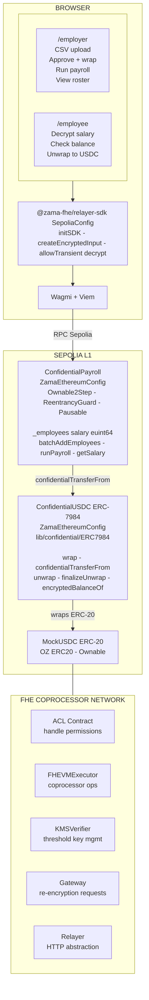
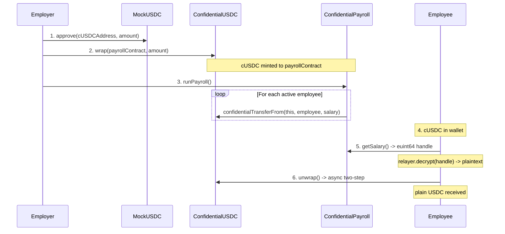
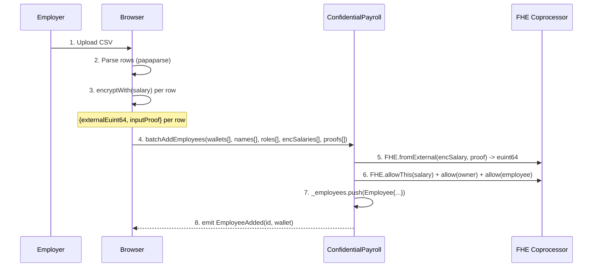
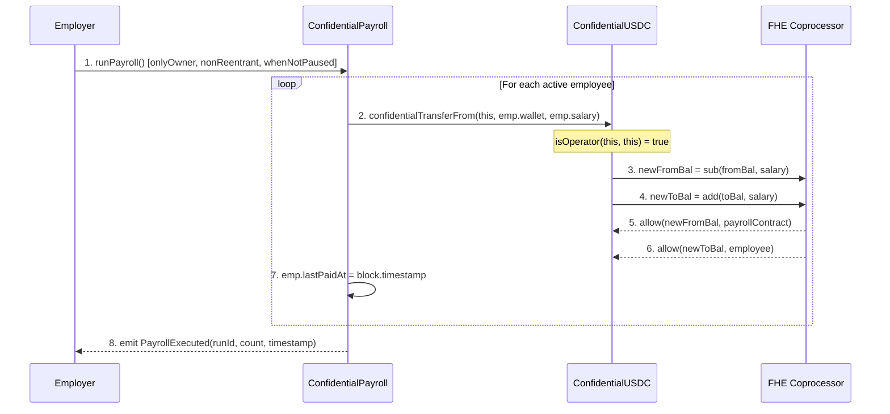
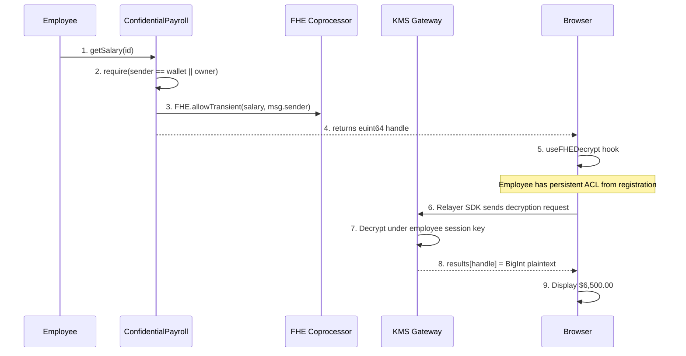
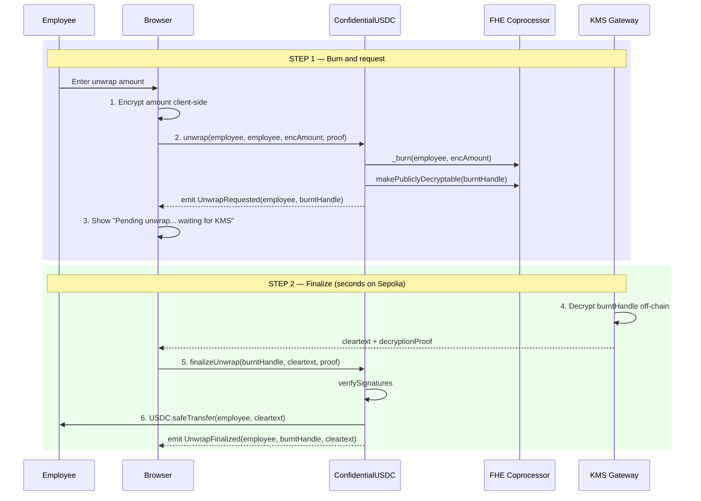

# ConfidentialPay — Technical PRD

**Version:** 1.0.0
**Status:** Draft
**Date:** 2026-03-12
**Bounty:** Confidential Payroll dApp — fhEVM Protocol
**Network:** Sepolia Testnet

---

## Table of Contents

1. [Overview and Scope](#1-overview-and-scope)
2. [Problem Statement](#2-problem-statement)
3. [Bounty Requirements Mapping](#3-bounty-requirements-mapping)
4. [User Stories](#4-user-stories)
5. [System Architecture](#5-system-architecture)
6. [Technology Stack](#6-technology-stack)
7. [Cryptographic Architecture](#7-cryptographic-architecture)
8. [Smart Contract Specifications](#8-smart-contract-specifications)
9. [Frontend Specifications](#9-frontend-specifications)
10. [Key Data Flows](#10-key-data-flows)
11. [Security Model](#11-security-model)
12. [Gas Targets](#12-gas-targets)
13. [Testing Strategy](#13-testing-strategy)
14. [Development Workflow (BootNode SDLC)](#14-development-workflow-bootnode-sdlc)
15. [Deployment](#15-deployment)
16. [Success Metrics](#16-success-metrics)
17. [Open Questions](#17-open-questions)

---

## 1. Overview and Scope

ConfidentialPay is an on-chain payroll dApp where a company pays employees in encrypted USDC while keeping all individual salary amounts and payment values private on-chain. It uses the fhEVM coprocessor and ERC-7984 confidential tokens.

### What the dApp does

| Actor | Can do |
|---|---|
| Payroll Manager | Upload employees via CSV, fund the payroll contract with cUSDC, run payroll in one transaction |
| Employee | Connect wallet, decrypt their own salary in the browser, confirm received payment, unwrap cUSDC to plain USDC |
| External observer | See only transaction hashes and encrypted handles — zero salary or amount data |

### Scope boundaries

**In scope:**
- Three smart contracts: `MockUSDC`, `ConfidentialUSDC` (ERC-7984), `ConfidentialPayroll`
- Two-page frontend: `/employer` and `/employee`
- `lib/confidential/` — local copy of the ERC7984 confidential token library

**Out of scope:** salary updates, income attestations, vesting, multi-currency, mainnet, KYC.

**Bonus (mentioned, not implemented in v1):** Gnosis Safe App integration at `/safe` — wraps employer transactions in a multisig for real company use.

---

## 2. Problem Statement

Every EVM state variable is public. Storing `uint256 salary` makes every employee's compensation readable by competitors, colleagues, and regulators. Even with off-chain storage, payment transfers on-chain emit plaintext amounts in `Transfer` events.

Fully Homomorphic Encryption solves this at the protocol level. The fhEVM coprocessor executes arithmetic on ciphertexts without decrypting them. The ERC-7984 standard replaces `uint256` balances with `euint64` handles. Salary amounts and payroll transfer values remain encrypted on-chain at all times. Two flows do disclose amounts: wrapping USDC emits the deposit amount in `USDCWrapped`, and finalizing an unwrap request reveals the withdrawn amount once the KMS decryption proof is submitted — both are user-initiated and disclosed upfront in the UI.

---

## 3. Bounty Requirements Mapping

| Bounty Requirement | Implementation |
|---|---|
| Employer adds employees and sets encrypted salaries | `ConfidentialPayroll.batchAddEmployees()` accepts CSV-derived arrays; salary is `externalEuint64` encrypted client-side |
| Salaries confidential — only employer and employee can view | `getSalary()` enforces `msg.sender == employer OR msg.sender == employee`; returns handle with `FHE.allowTransient` for relayer decryption |
| Employer executes payroll keeping amounts confidential | `runPayroll()` calls `cUSDC.confidentialTransferFrom(address(this), employee, salary_handle)` in a loop; no amounts in events |
| Employees verify and decrypt their own payment | Employee calls `getSalary()` and `cUSDC.encryptedBalanceOf()`, relayer SDK decrypts handle locally |
| Additional: Safe App (bonus) | Mentioned in codebase; not implemented in v1 |

---

## 4. User Stories

### US-01 — Load Employees (Payroll Manager)

> I upload a CSV file (`address,name,role,monthly_usdc`). The app encrypts each salary client-side using the relayer SDK, then sends a single `batchAddEmployees` transaction. All salary handles are stored on-chain; no amounts are visible.

**CSV format:**
```csv
address,name,role,monthly_usdc
0xAbc...,Alice Martin,Senior Engineer,6500
0xDef...,Bob Chen,Product Designer,5200
0xGhi...,Carlos Lima,DevOps,5800
```

### US-02 — Fund Payroll (Payroll Manager)

> I deposit USDC into the payroll contract in two steps:
> 1. Approve cUSDC contract: `USDC.approve(cUSDCAddress, amount)`
> 2. Wrap directly to payroll: `cUSDC.wrap(payrollContractAddress, amount)`
>
> The cUSDC is minted directly to the payroll contract's balance. No intermediate deposit function is needed on `ConfidentialPayroll`.

### US-03 — Run Payroll (Payroll Manager)

> I click "Run Payroll". One transaction calls `runPayroll()` which transfers each active employee's salary as cUSDC from the contract to their wallet. No amounts appear in events or storage.

### US-04 — View Employee Roster (Payroll Manager)

> I see the roster (name, role, address, status). The salary column shows `🔒 Encrypted`. I click "Reveal" on any row — the contract returns the salary handle with `FHE.allowTransient` — and I decrypt it locally via the relayer SDK. I see the plaintext amount for that browser session.

### US-05 — Decrypt My Salary (Employee)

> I connect my wallet. I click "Decrypt Salary". The app calls `getSalary(id)` on-chain — the contract returns the `euint64` handle with transient ACL access granted to my wallet. The relayer SDK decrypts the handle locally (using ACL permission set at registration time). I see `$6,500.00 / month`. Nothing was sent to a server.

### US-06 — Confirm Payment (Employee)

> After payroll runs, I click "Check Balance". The app calls `cUSDC.encryptedBalanceOf()` — same handle + relayer decryption flow. I see my current cUSDC balance.

### US-07 — Unwrap to Plain USDC (Employee)

> I enter an amount and click "Unwrap to USDC". The app encrypts the amount client-side and calls `cUSDC.unwrap(me, me, encAmount, proof)`. This burns my cUSDC. The encrypted amount is made publicly decryptable by the KMS off-chain. Once the KMS decryption proof is available (typically within seconds on Sepolia), the app calls `finalizeUnwrap(burntHandle, cleartext, proof)` automatically and my wallet receives plain USDC.
>
> **Disclosed to user:** The withdrawal amount becomes visible on-chain only when `finalizeUnwrap` is called with the KMS proof. The frontend shows "Pending unwrap…" until finalization.

### US-08 — External Observer

> An outside address queries the contracts. They see `euint64` opaque handles in state — 256-bit ciphertexts. `Transfer` events from `ConfidentialUSDC` include only `from`/`to` addresses, no amounts. Salary handles can only be decrypted by ACL-authorized addresses via the relayer.

---

## 5. System Architecture

### 5.1 High-Level Diagram



### 5.2 Token Flow



---

## 6. Technology Stack

### 6.1 Monorepo

Based on **`fhevm-react-template`** (pnpm monorepo). We adopt it as-is and replace only the contracts and pages.

```
packages/
├── hardhat/            ← contracts + lib/confidential/
│   ├── contracts/
│   │   ├── MockUSDC.sol
│   │   ├── ConfidentialUSDC.sol
│   │   ├── ConfidentialPayroll.sol
│   │   └── interfaces/
│   │       └── IConfidentialUSDC.sol
│   └── lib/
│       └── confidential/           ← local copy — ERC7984 confidential token library
│           ├── interfaces/
│           │   ├── IERC7984.sol
│           │   └── IERC7984Receiver.sol
│           ├── token/ERC7984/
│           │   ├── ERC7984.sol
│           │   ├── extensions/
│           │   │   └── ERC7984ERC20Wrapper.sol
│           │   └── utils/
│           │       └── ERC7984Utils.sol
│           └── utils/
│               └── FHESafeMath.sol
├── nextjs/             ← frontend (keep package name, replace pages)
└── fhevm-sdk/          ← FHE hook library (keep untouched)
```

**No custom backend is needed.** Every operation is:
- A direct Sepolia RPC call (via Wagmi/Viem in the browser), or
- An HTTP call to the FHE Relayer (handled internally by `@zama-fhe/relayer-sdk`)

Fully static/client-side — deploys to Vercel with zero server configuration.

### 6.2 Smart Contracts (`packages/hardhat/`)

| Package | Version | Purpose |
|---|---|---|
| `@fhevm/solidity` | `^0.11.1` | `FHE.sol`, `ZamaEthereumConfig`, encrypted types, ACL |
| `@openzeppelin/contracts` | `^5.0.2` | `Ownable2Step`, `ReentrancyGuard`, `ERC20`, `Pausable`, `SafeERC20` |
| `hardhat` | `^2.26.0` | Development environment |
| `@fhevm/hardhat-plugin` | `^0.4.2` | fhEVM network integration |
| `@fhevm/mock-utils` | `0.4.2` | Mock coprocessor for local tests |
| `@nomicfoundation/hardhat-ethers` | `^3.1.3` | ethers.js integration |
| `@nomicfoundation/hardhat-verify` | `^2.1.0` | Etherscan verification |
| `solidity-coverage` | `^0.8.16` | Coverage reports |
| `hardhat-gas-reporter` | `^2.3.0` | Gas cost reporting |
| Solidity | `0.8.27` | Compiler version |

**`lib/confidential/` — local library (not an npm package):**

| File | Provides |
|---|---|
| `ERC7984.sol` | Base confidential token — balances as `euint64`, encrypted transfer logic, `isOperator`, `encryptedBalanceOf` |
| `ERC7984ERC20Wrapper.sol` | Wraps plain ERC-20 into ERC-7984 — `wrap()`, `unwrap()` (async 2-step), `finalizeUnwrap()` |
| `FHESafeMath.sol` | Safe FHE arithmetic via `tryIncrease`/`tryDecrease` |
| `ERC7984Utils.sol` | Transfer callback utilities |
| `IERC7984.sol` / `IERC7984Receiver.sol` | Interfaces |

> **Why local copy, not npm?** `@openzeppelin/confidential-contracts` is published to npm but version 0.3.1 (latest) requires `@fhevm/solidity@0.9.1` as a peer dep — incompatible with the `^0.11.1` used throughout this project. The local copy has been validated against `^0.11.1` on Sepolia.

### 6.3 Frontend (`packages/nextjs/`)

All packages come pre-installed in the template. We add only what is missing.

| Package | Version | Source | Purpose |
|---|---|---|---|
| `next` | `~15.2.3` | template | App Router framework |
| `react` / `react-dom` | `~19.0.0` | template | UI library |
| `typescript` | `~5.8.2` | template | Type safety |
| `wagmi` | `2.16.4` | template | React wallet hooks |
| `viem` | `2.34.0` | template | EVM client library |
| `@rainbow-me/rainbowkit` | `2.2.8` | template | Wallet connection UI |
| `@zama-fhe/relayer-sdk` | `0.4.2` | template | Encrypt inputs, decrypt handles |
| `@fhevm-sdk` | `workspace:*` | template | `useFHEEncryption`, `useFHEDecrypt`, `useInMemoryStorage` hooks |
| `zustand` | `~5.0.0` | template | Client-side state management |
| `tailwindcss` | `4.1.3` | template | Styling |
| `daisyui` | `5.0.9` | template | UI component library |
| `ethers` | `^6.16.0` | template | Contract interaction (used by fhevm-sdk) |
| `papaparse` | `~5.5.x` | **add** | CSV parsing for employee upload |
| `@types/papaparse` | latest | **add** | TypeScript types |

### 6.4 FHE SDK Hook API (from `packages/fhevm-sdk/`)

**Encrypt a value before sending to contract:**
```typescript
import { useFHEEncryption } from '@fhevm-sdk';

const { encryptWith } = useFHEEncryption({
  instance,           // FhevmInstance from context
  ethersSigner,       // from useWagmiEthers
  contractAddress,    // target contract
});

const enc = await encryptWith(builder => {
  builder.add64(BigInt(salary * 1_000_000));  // USDC micro-units
});
// enc.handles[0]  → externalEuint64 for calldata
// enc.inputProof  → bytes proof for calldata
```

**Decrypt an encrypted handle returned by a contract:**
```typescript
import { useFHEDecrypt, useInMemoryStorage } from '@fhevm-sdk';

const { storage } = useInMemoryStorage();

const { decrypt, results, isDecrypting } = useFHEDecrypt({
  instance,
  ethersSigner,
  fhevmDecryptionSignatureStorage: storage,
  chainId,
  requests: [{ handle: salaryHandle, contractAddress: payrollAddress }],
});

// After decrypt() resolves:
const salary = Number(results[salaryHandle]) / 1_000_000;
```

---

## 7. Cryptographic Architecture

### 7.1 FHE Library API (`@fhevm/solidity@^0.11.1`)

The current library uses `FHE.*` namespacing. **The old `TFHE.*` API is archived and must not be used.**

**Import pattern:**
```solidity
import {FHE, euint64, externalEuint64, ebool} from "@fhevm/solidity/lib/FHE.sol";
import {ZamaEthereumConfig} from "@fhevm/solidity/config/ZamaConfig.sol";
```

**Coprocessor initialization — via inheritance, not constructor call:**
```solidity
// CORRECT ✓
contract ConfidentialPayroll is ZamaEthereumConfig, Ownable2Step, ReentrancyGuard, Pausable { ... }

// WRONG — does not exist ✗
// FHE.setCoprocessor(CoprocessorSetup.defaultConfig());
```

`ZamaEthereumConfig` is a base contract that wires the ACL, FHEVMExecutor, and KMSVerifier addresses. Inheriting it is all that is required.

**Encrypted types used:**

| Type | Bits | Used for |
|---|---|---|
| `euint64` | 64 | Salary handles, cUSDC balances |
| `ebool` | 1 | Transfer condition flags (internal to ERC7984) |
| `externalEuint64` | — | Calldata input type (encrypted client-side) |

**Core operations:**

```solidity
// Convert client-encrypted input → on-chain handle
euint64 handle = FHE.fromExternal(externalAmount, inputProof);

// Authorization check before using a passed-in handle
require(FHE.isAllowed(handle, msg.sender), "Not authorized for this handle");

// ACL — set immediately after creating/storing a handle
FHE.allowThis(handle);           // allow this contract
FHE.allow(handle, someAddress);  // allow a specific address

// Transient access — grant caller temporary access, return handle
return FHE.allowTransient(handle, msg.sender);

// Arithmetic (ciphertext → ciphertext)
euint64 sum  = FHE.add(a, b);
euint64 diff = FHE.sub(a, b);
euint64 zero = FHE.asEuint64(0);

// Comparison (returns ebool ciphertext)
ebool ok = FHE.le(amount, balance);

// Conditional (CMUX — never plaintext if/else on encrypted values)
euint64 actual = FHE.select(ok, amount, FHE.asEuint64(0));
```

### 7.2 ACL Rules

Every `euint64` stored in state must have explicit ACL entries set at write time.

| When | What to call |
|---|---|
| Storing a new salary handle | `FHE.allowThis(salary)` + `FHE.allow(salary, owner())` + `FHE.allow(salary, employeeWallet)` |
| Returning a handle to a caller | `FHE.allowTransient(handle, msg.sender)` |
| Cross-contract call with a handle | `FHE.allow(handle, targetContract)` |

ERC7984's `_update()` automatically calls `FHE.allow(newBalance, from)` and `FHE.allow(newBalance, to)` after every transfer — no manual ACL needed for balance updates.

### 7.3 Sender Authorization Check

When a function receives a `euint64` handle as a parameter (not `externalEuint64`), verify the caller has ACL access before using it:

```solidity
function transfer(address to, euint64 amount) public {
    require(FHE.isAllowed(amount, msg.sender), "Not authorized for this handle");
    // ...
}
```

### 7.4 Re-encryption / Decryption Protocol

The FHE Relayer abstracts all Gateway Chain interactions. Frontend calls the relayer over HTTP; users only need a Sepolia wallet.

**Encryption flow (client → contract):**
```typescript
import { initSDK, SepoliaConfig } from '@zama-fhe/relayer-sdk/web';

const sdk = await initSDK(SepoliaConfig);
const input = sdk.createEncryptedInput(contractAddress, userAddress);
input.add64(BigInt(salary * 1_000_000));
const encrypted = await input.encrypt();
// encrypted.handles[0]  → externalEuint64
// encrypted.inputProof  → bytes
```

**Decryption flow (handle → plaintext):**
```typescript
// Contract exposes:
//   getSalary(id) external returns (euint64)
//   → internally: return FHE.allowTransient(salary, msg.sender)

// Frontend: call getSalary() on-chain, get the handle
const salaryHandle = await payrollContract.getSalary(employeeId);

// Pass handle to useFHEDecrypt hook — relayer does the rest
// (employee has persistent ACL from FHE.allow set at registration)
const { decrypt, results } = useFHEDecrypt({
  requests: [{ handle: salaryHandle, contractAddress: payrollAddress }],
  ...
});
const plaintext = Number(results[salaryHandle]) / 1_000_000;
```

No ephemeral keypair generation, no EIP-712 permit, no `sealoutput` bytes.

### 7.5 ERC7984 `isOperator` Rule

`isOperator(holder, spender)` returns `true` when `holder == spender`. This means `ConfidentialPayroll` can call `confidentialTransferFrom(address(this), employee, salary)` on its own cUSDC balance without any extra approval step — the contract is always an operator on its own holdings.

### 7.6 Prohibited Patterns

| Anti-pattern | Why | Correct alternative |
|---|---|---|
| `TFHE.*` | Archived API | Use `FHE.*` |
| `CoprocessorSetup` / `FHE.setCoprocessor()` | Does not exist in `^0.11.1` | Inherit `ZamaEthereumConfig` |
| `FHE.sealoutput(handle, publicKey)` | Old re-encryption pattern | `FHE.allowTransient(handle, msg.sender)` + return handle |
| `FHE.isSenderAllowed(handle)` | Does not exist | `FHE.isAllowed(handle, msg.sender)` |
| Plaintext `uint256 salary` | Defeats encryption | `externalEuint64` → `FHE.fromExternal()` |
| `if (decryptedValue > 0)` in contract | Async oracle, gas explosion | `FHE.select(FHE.gt(a, b), x, y)` |
| Emitting `euint64` handle values in events | Handle exposure | Emit only addresses and metadata |
| Forgetting `FHE.allow(salary, employeeWallet)` at registration | Employee decryption reverts | Set ACL at write time |
| `@openzeppelin/confidential-contracts` npm | Peer dep conflict with `@fhevm/solidity@^0.11.1` | Use `lib/confidential/` local copy |

---

## 8. Smart Contract Specifications

### 8.1 Contract Overview

| Contract | Inherits | Role |
|---|---|---|
| `MockUSDC` | OZ `ERC20`, `Ownable` | Mintable USDC for Sepolia testing |
| `ConfidentialUSDC` | `ZamaEthereumConfig`, `ERC7984ERC20Wrapper` | Wraps USDC ↔ cUSDC; all token logic in base |
| `ConfidentialPayroll` | `ZamaEthereumConfig`, OZ `Ownable2Step`, `ReentrancyGuard`, `Pausable` | Employee registry, salary storage, payroll execution |

---

### 8.2 `MockUSDC`

```solidity
// SPDX-License-Identifier: MIT
pragma solidity ^0.8.27;

import {ERC20} from "@openzeppelin/contracts/token/ERC20/ERC20.sol";
import {Ownable} from "@openzeppelin/contracts/access/Ownable.sol";

/// @title MockUSDC
/// @notice Mintable ERC-20 for Sepolia testing only. Open mint — do not deploy to mainnet.
contract MockUSDC is ERC20, Ownable {
    constructor() ERC20("USD Coin", "USDC") Ownable(msg.sender) {}

    function decimals() public pure override returns (uint8) {
        return 6;
    }

    function mint(address to, uint256 amount) external {
        _mint(to, amount);
    }
}
```

---

### 8.3 `ConfidentialUSDC` (ERC-7984)

Inherits `ZamaEthereumConfig` and `ERC7984ERC20Wrapper`. The base class provides complete wrap, unwrap, transfer, and balance logic.

```solidity
// SPDX-License-Identifier: MIT
pragma solidity ^0.8.27;

import {ZamaEthereumConfig} from "@fhevm/solidity/config/ZamaConfig.sol";
import {IERC20} from "@openzeppelin/contracts/token/ERC20/IERC20.sol";
import {ERC7984} from "../lib/confidential/token/ERC7984/ERC7984.sol";
import {ERC7984ERC20Wrapper} from
    "../lib/confidential/token/ERC7984/extensions/ERC7984ERC20Wrapper.sol";

/// @title ConfidentialUSDC
/// @notice ERC-7984 confidential wrapper over plain USDC.
///
/// Funding the payroll contract:
///   1. USDC.approve(address(this), amount)          — caller approves cUSDC to spend USDC
///   2. cUSDC.wrap(payrollContractAddress, amount)   — cUSDC minted directly to payroll
///
/// Unwrapping (async two-step):
///   1. cUSDC.unwrap(from, to, encAmount, proof)     — burns cUSDC, emits UnwrapRequested
///   2. cUSDC.finalizeUnwrap(burntHandle, clear, pf) — KMS proof → sends plain USDC
contract ConfidentialUSDC is ZamaEthereumConfig, ERC7984ERC20Wrapper {
    event USDCWrapped(address indexed from, address indexed to, uint256 amount);

    constructor(address usdcAddress)
        ERC7984("Confidential USDC", "cUSDC", "")
        ERC7984ERC20Wrapper(IERC20(usdcAddress))
    {}

    /// @notice Override to emit a tracking event. Caller must approve this contract first.
    function wrap(address to, uint256 amount) public override {
        super.wrap(to, amount);
        emit USDCWrapped(msg.sender, to, amount);
    }
}
```

**Inherited functions used by the system:**

| Function | Signature | Called by |
|---|---|---|
| `wrap` | `wrap(address to, uint256 amount)` | Employer (frontend) |
| `confidentialTransferFrom` | `confidentialTransferFrom(address from, address to, euint64 amount)` | ConfidentialPayroll.runPayroll() |
| `encryptedBalanceOf` | `encryptedBalanceOf() returns (euint64)` | Employee (frontend) |
| `unwrap` | `unwrap(address from, address to, externalEuint64, bytes)` | Employee (frontend) |
| `finalizeUnwrap` | `finalizeUnwrap(bytes32 burntHandle, uint64 cleartext, bytes proof)` | Frontend (auto, after KMS) |

---

### 8.4 `ConfidentialPayroll`

```solidity
// SPDX-License-Identifier: MIT
pragma solidity ^0.8.27;

import {FHE, euint64, externalEuint64} from "@fhevm/solidity/lib/FHE.sol";
import {ZamaEthereumConfig} from "@fhevm/solidity/config/ZamaConfig.sol";
import {Ownable2Step, Ownable} from "@openzeppelin/contracts/access/Ownable2Step.sol";
import {ReentrancyGuard} from "@openzeppelin/contracts/utils/ReentrancyGuard.sol";
import {Pausable} from "@openzeppelin/contracts/utils/Pausable.sol";
import {IERC20} from "@openzeppelin/contracts/interfaces/IERC20.sol";
import {IConfidentialUSDC} from "./interfaces/IConfidentialUSDC.sol";

/// @title ConfidentialPayroll
/// @notice Stores encrypted employee salaries and executes confidential payroll runs.
///
/// Funding: employer calls cUSDC.wrap(address(this), amount) directly — no depositFunds()
/// needed on this contract. ERC7984's isOperator(address(this), address(this)) = true
/// enables confidentialTransferFrom on own balance without extra approval.
contract ConfidentialPayroll is ZamaEthereumConfig, Ownable2Step, ReentrancyGuard, Pausable {

    // ─── Types ─────────────────────────────────────────────────────────────────

    struct Employee {
        address wallet;
        string  name;        // plaintext — not sensitive
        string  role;        // plaintext — not sensitive
        euint64 salary;      // encrypted monthly salary (USDC micro-units, 6 decimals)
        bool    active;
        uint256 lastPaidAt;
    }

    // ─── Events ────────────────────────────────────────────────────────────────

    event EmployeeAdded(uint256 indexed id, address indexed wallet);
    event EmployeeDeactivated(uint256 indexed id, address indexed wallet);
    /// @dev employeeCount is the number of active employees paid, not total.
    event PayrollExecuted(uint256 indexed runId, uint256 employeeCount, uint256 timestamp);

    // ─── Errors ────────────────────────────────────────────────────────────────

    error Unauthorized();
    error EmployeeNotFound();
    error LengthMismatch();
    error BatchTooLarge();
    error ZeroAddress();

    // ─── State ─────────────────────────────────────────────────────────────────

    IConfidentialUSDC public immutable cUSDC;
    IERC20            public immutable USDC;

    Employee[]                  private _employees;
    mapping(address => uint256) public  walletToId;   // 1-indexed; 0 = not registered

    uint256 public payrollRunCount;

    // TODO: benchmark runPayroll() gas on Sepolia with 20+ employees.
    //       If approaching 30M block gas limit, add paginated runPayroll(startId, endId).
    uint256 public constant MAX_BATCH = 100;

    // ─── Constructor ───────────────────────────────────────────────────────────

    constructor(address cUSDCAddress, address usdcAddress) Ownable(msg.sender) {
        if (cUSDCAddress == address(0) || usdcAddress == address(0)) revert ZeroAddress();
        cUSDC = IConfidentialUSDC(cUSDCAddress);
        USDC  = IERC20(usdcAddress);
    }

    // ─── Employer functions ────────────────────────────────────────────────────

    /// @notice Register multiple employees in one transaction.
    /// @dev Each salary is encrypted client-side and passed as externalEuint64 + proof.
    ///      Salary is immutable after registration. To change a salary: deactivate + re-add.
    function batchAddEmployees(
        address[]         calldata wallets,
        string[]          calldata names,
        string[]          calldata roles,
        externalEuint64[] calldata encSalaries,
        bytes[]           calldata inputProofs
    ) external onlyOwner {
        uint256 len = wallets.length;
        if (len > MAX_BATCH) revert BatchTooLarge();
        if (
            len != names.length ||
            len != roles.length ||
            len != encSalaries.length ||
            len != inputProofs.length
        ) revert LengthMismatch();

        for (uint256 i = 0; i < len; ) {
            euint64 salary = FHE.fromExternal(encSalaries[i], inputProofs[i]);
            _registerEmployee(wallets[i], names[i], roles[i], salary);
            unchecked { ++i; }
        }
    }

    /// @notice Deactivate an employee. Salary handle is retained but no longer paid.
    ///         To update a salary: deactivate + re-add with new encrypted salary.
    function deactivateEmployee(uint256 id) external onlyOwner {
        if (id == 0 || id > _employees.length) revert EmployeeNotFound();
        Employee storage emp = _employees[id - 1];
        emp.active = false;
        emit EmployeeDeactivated(id, emp.wallet);
    }

    /// @notice Transfer each active employee's monthly salary from this contract's
    ///         cUSDC balance to their wallet.
    ///
    /// Works because ERC7984.isOperator(address(this), address(this)) = true —
    /// the contract is always an operator on its own balance.
    ///
    /// TODO: benchmark gas with 20+ employees on Sepolia.
    ///       Add paginated runPayroll(startId, endId) if approaching 30M block limit.
    function runPayroll() external onlyOwner nonReentrant whenNotPaused {
        uint256 count = 0;
        uint256 total = _employees.length;

        for (uint256 i = 0; i < total; ) {
            Employee storage emp = _employees[i];
            if (emp.active) {
                cUSDC.confidentialTransferFrom(address(this), emp.wallet, emp.salary);
                emp.lastPaidAt = block.timestamp;
                unchecked { ++count; }
            }
            unchecked { ++i; }
        }

        unchecked { ++payrollRunCount; }
        emit PayrollExecuted(payrollRunCount, count, block.timestamp);
    }

    function pause()   external onlyOwner { _pause(); }
    function unpause() external onlyOwner { _unpause(); }

    // ─── View / re-encryption ──────────────────────────────────────────────────

    /// @notice Returns the salary handle with transient ACL access for the caller.
    ///         Only the employer (owner) or the employee themselves can call this.
    ///         Frontend uses the returned euint64 handle with the relayer SDK to decrypt.
    function getSalary(uint256 id) external returns (euint64) {
        if (id == 0 || id > _employees.length) revert EmployeeNotFound();
        Employee storage emp = _employees[id - 1];
        if (msg.sender != emp.wallet && msg.sender != owner()) revert Unauthorized();
        return FHE.allowTransient(emp.salary, msg.sender);
    }

    function getEmployeeCount() external view returns (uint256) {
        return _employees.length;
    }

    /// @notice Returns plaintext employee metadata. Salary is excluded — use getSalary().
    function getEmployee(uint256 id) external view returns (
        address wallet,
        string memory name,
        string memory role,
        bool   active,
        uint256 lastPaidAt
    ) {
        if (id == 0 || id > _employees.length) revert EmployeeNotFound();
        Employee storage emp = _employees[id - 1];
        return (emp.wallet, emp.name, emp.role, emp.active, emp.lastPaidAt);
    }

    // ─── Internal ──────────────────────────────────────────────────────────────

    function _registerEmployee(
        address wallet,
        string memory name,
        string memory role,
        euint64 salary
    ) internal {
        if (wallet == address(0)) revert ZeroAddress();

        // Set persistent ACL so employer and employee can decrypt via relayer
        FHE.allowThis(salary);          // payroll contract can use handle in transfers
        FHE.allow(salary, owner());     // employer can call getSalary()
        FHE.allow(salary, wallet);      // employee can call getSalary()

        _employees.push(Employee({
            wallet:    wallet,
            name:      name,
            role:      role,
            salary:    salary,
            active:    true,
            lastPaidAt: 0
        }));

        walletToId[wallet] = _employees.length;  // 1-indexed
        emit EmployeeAdded(_employees.length, wallet);
    }
}
```

### 8.5 `IConfidentialUSDC` Interface

```solidity
// SPDX-License-Identifier: MIT
pragma solidity ^0.8.27;

import {euint64} from "@fhevm/solidity/lib/FHE.sol";

interface IConfidentialUSDC {
    function wrap(address to, uint256 amount) external;
    function confidentialTransferFrom(address from, address to, euint64 amount) external;
    function encryptedBalanceOf() external returns (euint64);
}
```

### 8.6 Deployment Order

```
1. Deploy MockUSDC
2. Deploy ConfidentialUSDC(mockUsdcAddress)
3. Deploy ConfidentialPayroll(cUSDCAddress, mockUsdcAddress)
4. Verify all three on Etherscan Sepolia
```

No post-deploy authorization step needed. `isOperator` in ERC7984 handles it natively.

---

## 9. Frontend Specifications

### 9.1 Route Map

| Route | Actor | Purpose |
|---|---|---|
| `/` | Any | Landing page — connect wallet, route to correct view |
| `/employer` | Payroll Manager | CSV upload, fund, run payroll, roster |
| `/employee` | Employee | Decrypt salary, check balance, unwrap |

### 9.2 `/employer` — Payroll Manager View

**Components:**

| Component | Description |
|---|---|
| `<CSVUpload>` | Drag-and-drop CSV; papaparse parses rows; preview table shown before encrypt |
| `<EncryptAndRegister>` | Encrypts each salary via `useFHEEncryption`; batches into `batchAddEmployees()` tx |
| `<FundPayroll>` | Amount input → `USDC.approve()` + `cUSDC.wrap(payrollContract, amount)` |
| `<RunPayrollButton>` | Calls `runPayroll()`; shows gas estimate warning if roster > 20 |
| `<EmployeeRoster>` | Table: name, role, address, status; salary shows `🔒 Encrypted` |
| `<RevealSalary>` | Per-row button: calls `getSalary(id)` → `useFHEDecrypt` → shows plaintext |

**Encrypt + register flow:**
```typescript
// 1. Parse CSV
const rows = Papa.parse(csvText, { header: true }).data;

// 2. Encrypt each salary
const encrypted = await Promise.all(rows.map(async (row) => {
  const enc = await encryptWith(b => b.add64(BigInt(Number(row.monthly_usdc) * 1_000_000)));
  return { wallet: row.address, name: row.name, role: row.role, enc };
}));

// 3. Batch transaction
await payrollContract.batchAddEmployees(
  encrypted.map(e => e.wallet),
  encrypted.map(e => e.name),
  encrypted.map(e => e.role),
  encrypted.map(e => e.enc.handles[0]),   // externalEuint64[]
  encrypted.map(e => e.enc.inputProof),   // bytes[]
);
```

**Fund flow:**
```typescript
// Employer approves cUSDC contract, then wraps directly to payroll
await usdcContract.approve(cUSDCAddress, amount);
await cUSDCContract.wrap(payrollContractAddress, amount);
```

### 9.3 `/employee` — Employee View

**Components:**

| Component | Description |
|---|---|
| `<SalaryCard>` | Shows `🔒 Encrypted` by default; "Decrypt" button triggers getSalary + relayer decrypt |
| `<BalanceCard>` | Shows cUSDC balance; "Refresh" calls `encryptedBalanceOf()` + relayer decrypt |
| `<UnwrapForm>` | Amount input + "Unwrap to USDC" — handles two-step async flow with pending state |

**Decrypt salary flow:**
```typescript
// 1. Call getSalary() on-chain (returns euint64 handle with transient ACL)
const salaryHandle = await payrollContract.getSalary(employeeId);

// 2. useFHEDecrypt hook decrypts via relayer (uses persistent ACL set at registration)
const { decrypt, results } = useFHEDecrypt({
  instance, ethersSigner,
  fhevmDecryptionSignatureStorage: storage,
  chainId,
  requests: [{ handle: salaryHandle, contractAddress: payrollAddress }],
});

await decrypt();
const salary = Number(results[salaryHandle]) / 1_000_000;  // USDC display value
```

**Unwrap to USDC (two-step):**
```typescript
// Step 1: Encrypt amount and call unwrap
const enc = await encryptWith(b => b.add64(BigInt(unwrapAmount * 1_000_000)));
const tx  = await cUSDCContract.unwrap(
  employeeAddress, employeeAddress,
  enc.handles[0], enc.inputProof
);
const receipt = await tx.wait();
// Parse UnwrapRequested event → get burntHandle
setStatus('Pending unwrap… waiting for KMS proof');

// Step 2: Listen for KMS proof availability, then finalize
// (relayer SDK or event polling for finalizable unwrap)
await cUSDCContract.finalizeUnwrap(burntHandle, cleartextAmount, decryptionProof);
setStatus('USDC received ✓');
```

### 9.4 State Management

Zustand stores:
- `walletStore` — connected address, chain, signer
- `fhevmStore` — SDK instance, initialized flag
- `employeeStore` — cached roster (employer view), decrypted salary cache (employee view)
- `pendingUnwrapsStore` — list of pending `burntHandle` entries awaiting finalization

---

## 10. Key Data Flows

### 10.1 Employee Registration



### 10.2 Payroll Execution



### 10.3 Salary Decryption



### 10.4 Two-Step Async Unwrap



---

## 11. Security Model

### 11.1 Threat Model

| Threat | Mitigation |
|---|---|
| Competitor reads employee salaries on-chain | Salaries stored as `euint64` ciphertexts; only ACL-authorized addresses can decrypt via relayer |
| Employer reads all salaries (legitimate) | `FHE.allow(salary, owner())` set at registration — employer can view all |
| Employee reads another employee's salary | `getSalary()` reverts if `msg.sender != emp.wallet && msg.sender != owner()` |
| External observer intercepts Transfer events | `ConfidentialUSDC` Transfer events contain only `from`/`to` — no amounts |
| Handle injection (passing arbitrary handle) | `FHE.isAllowed(handle, msg.sender)` check before using any passed-in handle |
| Reentrancy in runPayroll | `ReentrancyGuard` — `nonReentrant` modifier on `runPayroll()` |
| Employer draining employee cUSDC | ERC7984's operator model: employer is NOT an operator on employee wallets |
| Pausing payments in emergency | `Pausable` — `pause()` / `unpause()` — `onlyOwner` |

### 11.2 Privacy Guarantees

- **Salary amounts**: Never in plaintext on-chain. Encrypted at client before any transaction.
- **Payment amounts**: `confidentialTransferFrom` transfers the `euint64` handle directly — no amount in any event.
- **Balances**: ERC7984 `Transfer` events contain only `from`/`to`. Balance state is `euint64`.
- **Decryption**: Only ACL-authorized addresses (employer + specific employee) can decrypt a salary handle via the KMS Gateway.

### 11.3 Known Limitations

- **Unwrap amount visible post-finalization**: `finalizeUnwrap` emits the cleartext amount. This is a protocol-level constraint (KMS proof requires the cleartext). Disclosed to the user before initiating unwrap.
- **Salary immutable after registration**: No update function. To change a salary: deactivate employee + re-add. Both transactions are visible on-chain (but amounts remain encrypted).
- **Employer is single owner**: `Ownable2Step` adds transfer safety but there is no multi-sig by default. Safe App bonus would address this.

---

## 12. Gas Targets

| Operation | Target | Notes |
|---|---|---|
| `batchAddEmployees(10)` | < 6M gas | Each `FHE.fromExternal` + 3 ACL calls per employee |
| `batchAddEmployees(50)` | < 25M gas | Warn in UI if row count > 20 |
| `runPayroll()` per employee | ~300K gas | One `confidentialTransferFrom` + 2 FHE balance updates |
| `runPayroll(20 employees)` | < 8M gas | Comfortable within 30M Sepolia block limit |
| `getSalary()` | < 100K gas | One `FHE.allowTransient` call |
| `wrap(amount)` | < 200K gas | ERC20 transfer + FHE mint |
| `unwrap(amount)` | < 300K gas | FHE burn + makePubliclyDecryptable |

> **Gas warning:** `runPayroll()` with 50+ employees may approach Sepolia's 30M block gas limit. The TODO is tracked in code. Paginated `runPayroll(startId, endId)` is the planned fix if benchmarks exceed 25M gas.

---

## 13. Testing Strategy

### 13.1 Unit Tests (Hardhat + `@fhevm/mock-utils`)

Mock coprocessor handles FHE ops deterministically in local tests — no Docker, no network.

```typescript
import { getFhevm } from "@fhevm/mock-utils";

describe("ConfidentialPayroll", () => {
  it("registers employees with encrypted salaries", async () => {
    const fhevm = await getFhevm();
    const salary = await fhevm.encrypt64(BigInt(6500 * 1_000_000));
    await payroll.batchAddEmployees(
      [employee.address], ["Alice"], ["Engineer"],
      [salary.handle], [salary.proof]
    );
    const count = await payroll.getEmployeeCount();
    expect(count).to.equal(1n);
  });

  it("runs payroll and updates lastPaidAt", async () => { ... });
  it("getSalary reverts for unauthorized caller", async () => { ... });
  it("deactivated employees are skipped in runPayroll", async () => { ... });
  it("paused contract reverts runPayroll", async () => { ... });
});

describe("ConfidentialUSDC", () => {
  it("wrap mints cUSDC to target address", async () => { ... });
  it("confidentialTransferFrom works when caller is holder", async () => { ... });
  it("unwrap → finalizeUnwrap returns plain USDC", async () => { ... });
});
```

### 13.2 Integration Tests

```typescript
it("E2E: full payroll flow", async () => {
  // 1. Mint USDC
  await mockUSDC.mint(employer.address, 100_000 * 1e6);
  // 2. Approve + wrap to payroll
  await mockUSDC.connect(employer).approve(cUSDC.address, 100_000 * 1e6);
  await cUSDC.connect(employer).wrap(payroll.address, 100_000 * 1e6);
  // 3. Add employees
  const enc = await fhevm.encrypt64(BigInt(5000 * 1_000_000));
  await payroll.batchAddEmployees([emp.address], ["Bob"], ["Dev"], [enc.handle], [enc.proof]);
  // 4. Run payroll
  await payroll.connect(employer).runPayroll();
  // 5. Employee decrypts salary
  const handle = await payroll.connect(emp).getSalary(1);
  const plain  = await fhevm.decrypt64(handle);
  expect(plain).to.equal(5000n * 1_000_000n);
});
```

### 13.3 Coverage Target

- ≥ 95% line coverage via `solidity-coverage`
- All error paths tested (Unauthorized, EmployeeNotFound, LengthMismatch, ZeroAddress)
- All events tested with `emit` matchers

### 13.4 Frontend Tests (Vitest)

```typescript
// Unit test CSV parsing + encryption pipeline
test("parses CSV and produces correct batch arrays", () => {
  const csv = `address,name,role,monthly_usdc\n0xAbc,Alice,Eng,6500`;
  const rows = parseCSV(csv);
  expect(rows[0].monthly_usdc).toBe("6500");
});

// Component test: salary shows locked until decrypted
test("salary card shows 🔒 before decrypt", () => {
  render(<SalaryCard salaryHandle={null} />);
  expect(screen.getByText("🔒 Encrypted")).toBeTruthy();
});
```

---

## 14. Development Workflow (BootNode SDLC)

### 14.1 Repo Instrumentation

```
.github/
  ISSUE_TEMPLATE/
    1-bug.yml
    2-feature.yml
    3-epic.yml
    4-spike.yml
  PULL_REQUEST_TEMPLATE.md
  workflows/
    ci.yml
AGENTS.md          ← agent-agnostic config (stack, conventions, testing, commit rules)
CLAUDE.md → AGENTS.md  (symlink)
.claude/skills/    ← custom BootNode skills
```

`AGENTS.md` must include: Solidity version, FHE prohibited patterns (Section 7.6), `ZamaEthereumConfig` pattern, lib/confidential paths, test commands, commit standards.

### 14.2 Phase Map

| Phase | Artifact |
|---|---|
| Phase 1 — Discovery | This PRD |
| Phase 2 — Scoping | Epics + atomic issues created via `gh` CLI against `.github/ISSUE_TEMPLATE/` |
| Phase 3 — Execution | Feature branches; TDD cycle; `@fhevm/mock-utils` for contract tests |
| Phase 4 — Review | Pre-PR diff review; CodeRabbit AI gate; peer review |
| Phase 5 — Release | Sepolia deploy; Vercel deploy; demo video |

### 14.3 Issue Breakdown

**Epic 1 — Contracts**
```
- [ ] Copy lib/confidential/ into packages/hardhat/lib/
- [ ] Implement and test MockUSDC
- [ ] Implement and test ConfidentialUSDC (ZamaEthereumConfig + ERC7984ERC20Wrapper)
- [ ] Implement and test ConfidentialPayroll (batchAddEmployees, runPayroll, getSalary)
- [ ] Integration test: full E2E payroll flow (wrap → register → run → decrypt)
- [ ] Deploy script + Etherscan verification
```

**Epic 2 — Frontend**
```
- [ ] Bootstrap from fhevm-react-template; wire contract addresses + ABIs
- [ ] Employer: CSV upload + parse + encrypt + batchAddEmployees
- [ ] Employer: Approve USDC + wrap to payroll contract (fund flow)
- [ ] Employer: runPayroll button + gas warning for > 20 employees
- [ ] Employer: roster table + reveal salary (getSalary + useFHEDecrypt)
- [ ] Employee: decrypt salary (getSalary + useFHEDecrypt)
- [ ] Employee: check balance (encryptedBalanceOf + useFHEDecrypt)
- [ ] Employee: unwrap two-step flow + pending state UI
```

**Epic 3 — Infra**
```
- [ ] CI pipeline (lint + test + type-check on every push)
- [ ] Vercel deploy from main
- [ ] 2-minute demo video (all 6 user stories)
```

### 14.4 Branch Strategy

```
main          ← protected; requires PR + CI pass
feature/*     ← one issue = one branch = one PR
```

Branch naming: `feature/epic1-confidential-usdc`, `feature/epic2-csv-upload`, etc.
Parallel workstreams: use `git worktrees` (`SP:using-git-worktrees`).

### 14.5 CI Pipeline (`.github/workflows/ci.yml`)

```yaml
on: [push, pull_request]

jobs:
  contracts:
    runs-on: ubuntu-latest
    steps:
      - uses: actions/checkout@v4
      - uses: pnpm/action-setup@v4
      - run: pnpm install
      - run: cd packages/hardhat && pnpm lint        # solhint
      - run: cd packages/hardhat && pnpm test        # hardhat + mock coprocessor
      - run: cd packages/hardhat && pnpm coverage    # solidity-coverage

  frontend:
    runs-on: ubuntu-latest
    steps:
      - uses: actions/checkout@v4
      - uses: pnpm/action-setup@v4
      - run: pnpm install
      - run: cd packages/nextjs && pnpm check-types  # tsc --noEmit
      - run: cd packages/nextjs && pnpm lint         # oxlint
      - run: cd packages/nextjs && pnpm test         # vitest
```

### 14.6 Pre-Commit Hooks (`prek`)

```yaml
# .prek.yml
hooks:
  pre-commit:
    - cd packages/hardhat && pnpm lint
    - cd packages/nextjs && pnpm check-types && pnpm lint
```

---

## 15. Deployment

### 15.1 Hardhat Config

```typescript
// packages/hardhat/hardhat.config.ts
import '@fhevm/hardhat-plugin';
import '@nomicfoundation/hardhat-ethers';
import '@nomicfoundation/hardhat-verify';

const config: HardhatUserConfig = {
  solidity: {
    version: '0.8.27',
    settings: { optimizer: { enabled: true, runs: 200 } },
  },
  networks: {
    hardhat: { /* mock coprocessor auto-configured by @fhevm/hardhat-plugin */ },
    sepolia: {
      url: process.env.SEPOLIA_RPC_URL!,
      accounts: [process.env.DEPLOYER_PRIVATE_KEY!],
      chainId: 11155111,
    },
  },
  etherscan: {
    apiKey: { sepolia: process.env.ETHERSCAN_API_KEY! },
  },
  mocha: { timeout: 400_000 },
};
```

### 15.2 Deploy Script

```typescript
// packages/hardhat/scripts/deploy.ts
async function main() {
  const [deployer] = await ethers.getSigners();
  console.log('Deploying with:', deployer.address);

  // 1. MockUSDC
  const MockUSDC = await ethers.deployContract('MockUSDC');
  await MockUSDC.waitForDeployment();
  console.log('MockUSDC:', await MockUSDC.getAddress());

  // 2. ConfidentialUSDC
  const ConfidentialUSDC = await ethers.deployContract('ConfidentialUSDC', [
    await MockUSDC.getAddress(),
  ]);
  await ConfidentialUSDC.waitForDeployment();
  console.log('ConfidentialUSDC:', await ConfidentialUSDC.getAddress());

  // 3. ConfidentialPayroll
  const ConfidentialPayroll = await ethers.deployContract('ConfidentialPayroll', [
    await ConfidentialUSDC.getAddress(),
    await MockUSDC.getAddress(),
  ]);
  await ConfidentialPayroll.waitForDeployment();
  console.log('ConfidentialPayroll:', await ConfidentialPayroll.getAddress());

  // 4. Write addresses for frontend
  const addresses = {
    MockUSDC:            await MockUSDC.getAddress(),
    ConfidentialUSDC:    await ConfidentialUSDC.getAddress(),
    ConfidentialPayroll: await ConfidentialPayroll.getAddress(),
    network:             'sepolia',
    deployedAt:          new Date().toISOString(),
  };
  writeFileSync(
    'deployments/sepolia.json',
    JSON.stringify(addresses, null, 2)
  );

  // 5. Verify
  await run('verify:verify', { address: await MockUSDC.getAddress() });
  await run('verify:verify', {
    address: await ConfidentialUSDC.getAddress(),
    constructorArguments: [await MockUSDC.getAddress()],
  });
  await run('verify:verify', {
    address: await ConfidentialPayroll.getAddress(),
    constructorArguments: [
      await ConfidentialUSDC.getAddress(),
      await MockUSDC.getAddress(),
    ],
  });
}
```

### 15.3 Local Development

```bash
# 1. Clone fhevm-react-template
git clone https://github.com/zama-ai/fhevm-react-template confidentialpay
cd confidentialpay

# 2. Copy lib/confidential into the hardhat package
cp -r <source>/lib/confidential packages/hardhat/lib/confidential

# 3. Install all workspace dependencies
pnpm install

# 4. Run contract tests (mock coprocessor — no Docker needed)
cd packages/hardhat
cp .env.example .env
pnpm test

# 5. Deploy to local hardhat network
pnpm hardhat deploy --network hardhat

# 6. Start frontend
cd ../nextjs
cp .env.example .env.local
pnpm dev
# → http://localhost:3000
```

### 15.4 Environment Variables

```bash
# packages/hardhat/.env
SEPOLIA_RPC_URL=
DEPLOYER_PRIVATE_KEY=
ETHERSCAN_API_KEY=

# packages/nextjs/.env.local
NEXT_PUBLIC_CHAIN_ID=11155111
NEXT_PUBLIC_CONFIDENTIAL_PAYROLL_ADDRESS=
NEXT_PUBLIC_CONFIDENTIAL_USDC_ADDRESS=
NEXT_PUBLIC_MOCK_USDC_ADDRESS=
```

---

## 16. Success Metrics

| Metric | Acceptance Criterion |
|---|---|
| Contracts verified on Sepolia | All 3 contracts verified on Etherscan Sepolia |
| Salary confidentiality | `grep -r "TFHE\." contracts/` returns empty |
| No amounts in events | `Transfer` events in `ConfidentialUSDC` have only `from`/`to` |
| Correct init pattern | `ZamaEthereumConfig` in inheritance list of all 3 contracts; no `FHE.setCoprocessor()` call |
| Correct re-encryption | `FHE.allowTransient` used in `getSalary()`; no `sealoutput` anywhere |
| ACL enforced | E2E test: third-party wallet cannot decrypt salary via relayer |
| E2E payroll works | Full flow: wrap → register → runPayroll → getSalary → decrypt passes |
| Smart contract test coverage | ≥ 95% line coverage via `solidity-coverage` |
| TypeScript compiles clean | `tsc --noEmit` exits 0 |
| Demo video | 2-minute video showing US-01 through US-07 |

---

## 17. Open Questions

| ID | Question | Priority |
|---|---|---|
| OQ-01 | `runPayroll()` gas with 50 employees — needs benchmarking on Sepolia. If > 25M gas, implement `runPayroll(startId, endId)` pagination. | High — measure during development |
| OQ-02 | `finalizeUnwrap` exact signature in the local lib copy — verify parameter types match between `ConfidentialUSDC` call and `ERC7984ERC20Wrapper` base before integration testing. | High — verify during Epic 1 |
| OQ-03 | CSV encryption UX: 50 rows × ~300ms ≈ 15s client-side. Show per-row progress bar to avoid apparent hang. | Medium — UX polish |
| OQ-04 | Safe App bonus: verify Gnosis Safe is deployed on Sepolia before implementing `/safe` route. | Low — bonus feature |

---
