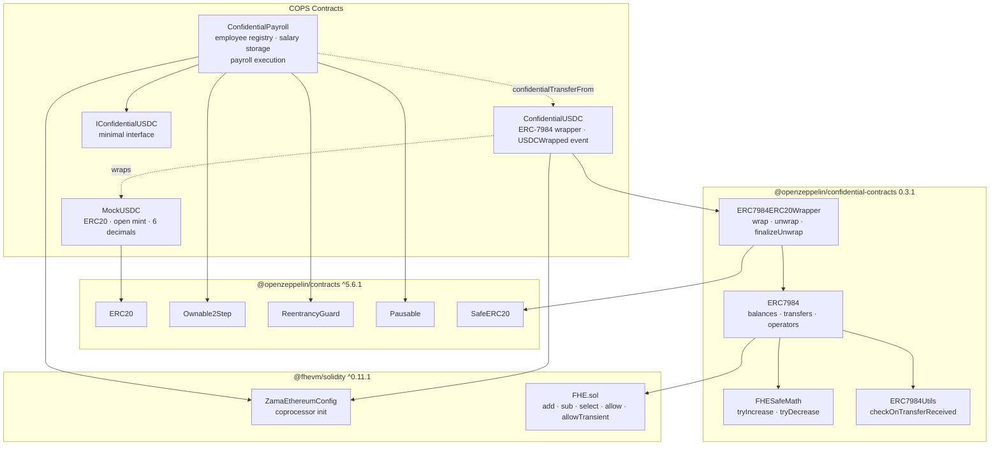
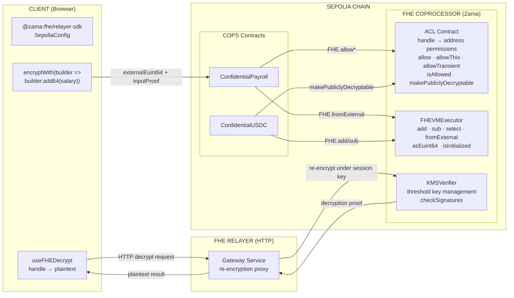
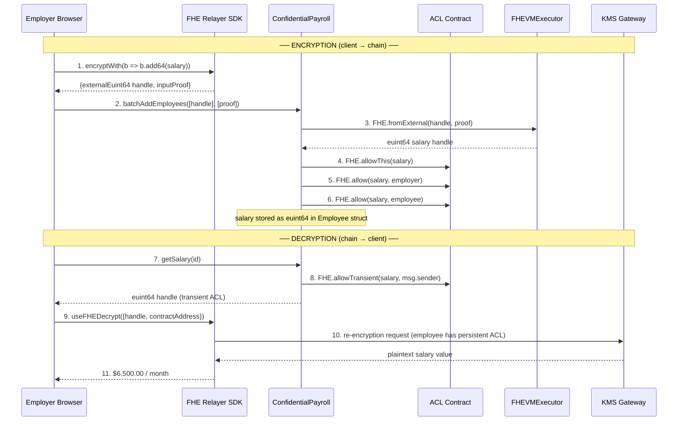
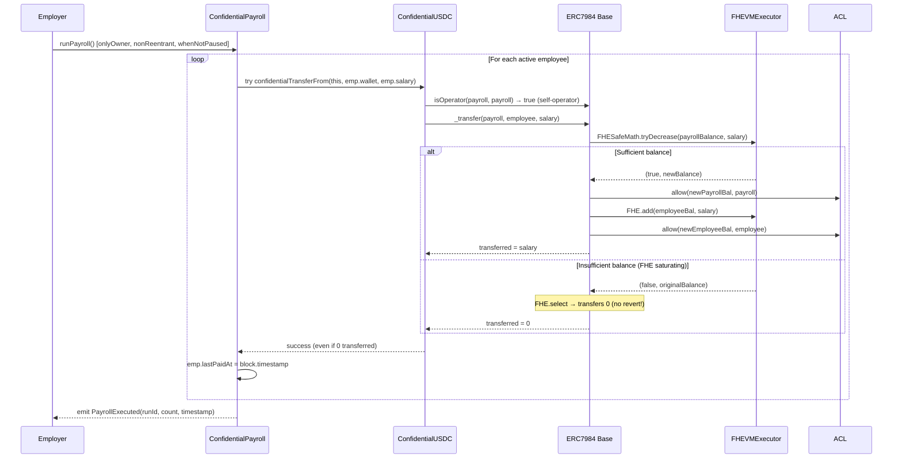
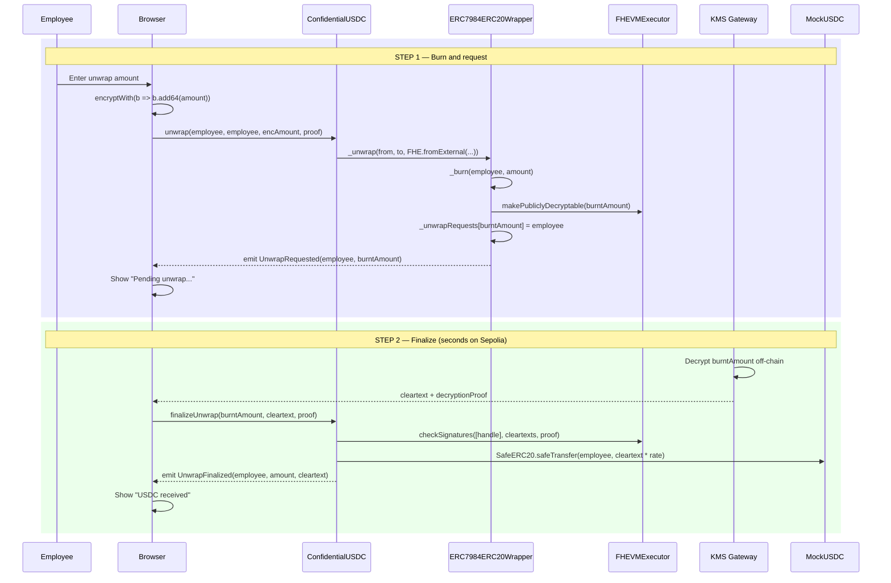
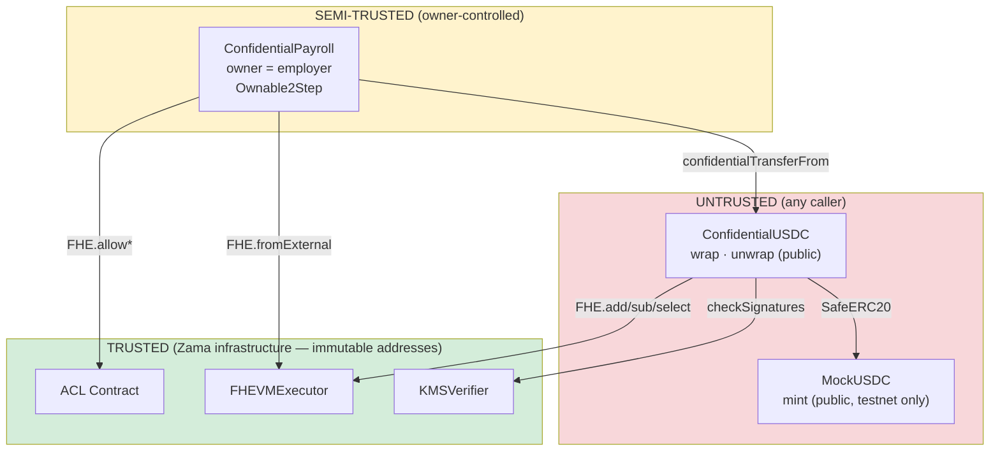

# COPS Contract Architecture

Reference architecture for the Confidential Onchain Payroll System smart contracts.

---

## Contract Dependency Graph



---

## FHE Coprocessor Architecture



---

## Encryption Lifecycle



---

## Payroll Execution — Transfer Flow



---

## Unwrap — Async Two-Step Flow



---

## Trust Boundaries



### Actor Permissions

| Actor | Can | Cannot |
|---|---|---|
| **Owner (employer)** | batchAddEmployees, deactivateEmployee, runPayroll, pause/unpause, getSalary (any ID) | Transfer employee cUSDC, modify salary, access other employer's contracts |
| **Employee** | getSalary (own ID only), unwrap own cUSDC, confidentialTransfer own cUSDC | View other employees' salaries, trigger runPayroll, register employees |
| **External observer** | Read getEmployee metadata, getEmployeeCount, walletToId | Decrypt any salary handle, view transfer amounts, call owner-only functions |
| **Zama infrastructure** | Execute FHE ops, manage ACL, verify KMS proofs | Modify contract state directly, override access control |

---

## Key Design Decisions

| Decision | Rationale |
|---|---|
| **npm `@openzeppelin/confidential-contracts@0.3.1`** instead of local `lib/confidential/` | Peer dep conflict with `@fhevm/solidity@^0.11.1` has been resolved in v0.3.1. npm is cleaner than vendored copy. |
| **No `depositFunds()`** on ConfidentialPayroll | ERC7984's `isOperator(self, self) = true` means the contract can spend its own cUSDC balance natively. |
| **Salary immutability** | Avoids complex ACL re-grant logic. To change salary: deactivate + re-add. |
| **`try/catch` in `runPayroll`** | Prevents a single reverting wallet from blocking all payments. Emits `PaymentFailed` for observability. |
| **Duplicate wallet guard** | Prevents silent double-payment from re-registering an active wallet. |
| **Old wallet cleared on re-hire** | Maintains `walletToId` invariant when deactivating and re-adding the same address. |
| **FHE saturating arithmetic** | `runPayroll` with insufficient balance silently transfers 0 (no revert). Documented in NatSpec. |

---

## Slither Compatibility

Slither cannot directly analyze fhEVM projects due to `@fhevm/hardhat-plugin` patching `ZamaConfig.sol` at compile time. The workaround patches the on-disk file to match build artifacts before running Slither:

```bash
cd packages/hardhat
ZAMA="node_modules/@fhevm/solidity/config/ZamaConfig.sol"
cp "$ZAMA" "$ZAMA.bak"
BINFO=$(find artifacts/build-info -name '*.json' | head -1)
python3 -c "
import json
d=json.load(open('$BINFO'))
content=d['input']['sources']['@fhevm/solidity/config/ZamaConfig.sol']['content']
open('$ZAMA','w').write(content)
"
uvx --from slither-analyzer slither . --hardhat-ignore-compile \
    --filter-paths "node_modules" --exclude-dependencies
cp "$ZAMA.bak" "$ZAMA" && rm "$ZAMA.bak"
```
